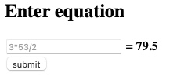
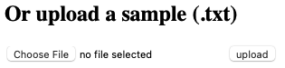
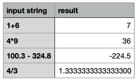

## Equation Evaluator – Documentation

This web app supports evaluations of arithmetic expressions.

## Language
Python 3

## Required packages
* [Flask](https://flask.palletsprojects.com/en/2.2.x/)
	* `pip install Flask`
* [Werkzeug](https://werkzeug.palletsprojects.com/en/2.2.x/)
	* `pip install Werkzeug`

## Running the app
1. Create a Python 3 virtual environment
2. Install the packages listed above
3. Clone this repository into your local directory
4. Within this repository, execute `flask run` in the command line
5. Open your browser, and view this web app at your local port `http://127.0.0.1:5000`

## User guide

This app support two modes of evaluating arithmetic expressions – direct type-in and file upload.

### Direct type-in



In the upper part of the app, you will see a textbox, an equal sign, and a submit button. Type your arithmetic expression (e.g. `3*53/2`) in the textbox, and press submit. The evaluation result (in this case, `79.2`) will pop up on the right hand side of the equal sign. Invalid expressions will result in `N/A`.

### File upload



In the bottom part of the app, one can upload a `.txt` file that lists multiple arithmetic expressions to be evaluated. An example file including 4 expressions is:

```
1+6
4*9
100.3 - 324.8
4/3
```

Note that only files with extension of `.txt` will be accepted. Once the file is selected, press `upload`. Then a message will be prompted at the bottom like this:


Press `here` to download a csv file containing the evaluation result, which, if you open it with a common spreadsheet engine, will look like this:

